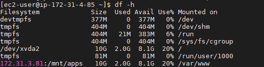

# Project 7 - DevOps tooling Website Solution
### Install lvm2
> sudo yum install lvm2

### Use gdisk utility to create a single partition on each of the 3 disks
```
 sudo gdisk /dev/xvdf 
 sudo gdisk /dev/xvdg
 sudo gdisk /dev/xvdh
 ```
 >lsblk

 

 ### Use pvcreate utility to mark each of 3 disks as physical volumes (PVs) to be used by LVM

 ```
 sudo pvcreate /dev/xvdf1
sudo pvcreate /dev/xvdg1
sudo pvcreate /dev/xvdh1
```

### Use vgcreate utility to add all 3 PVs to a volume group (VG). Name the VG webdata-vg
> sudo vgcreate webdata-vg /dev/xvdh1 /dev/xvdg1 /dev/xvdf1

### Create 3 logical volumes
```
sudo lvcreate -n lv-opt -L 9G webdata-vg
sudo lvcreate -n lv-apps -L 9G webdata-vg
sudo lvcreate -n lv-logs -L 9G webdata-vg
```
### Format disks as xfs
```
sudo mkfs -t xfs /dev/webdata-vg/lv-opt
sudo mkfs -t xfs /dev/webdata-vg/lv-apps
sudo mkfs -t xfs /dev/webdata-vg/lv-logs
```
### Create /mnt directory and opt,apps,logs therein
```
mkdir mnt && cd mnt
mkdir opt
mkdir apps
mkdir logs
```

### Mount the disks respectively
```
sudo mount /dev/webdata-vg/lv-opt mnt/opt
sudo mount /dev/webdata-vg/lv-apps mnt/apps
sudo mount /dev/webdata-vg/lv-logs mnt/logs
```
### Install NFS server, configure it to start on reboot and make sure it is up and running
```
sudo yum -y update
sudo yum install nfs-utils -y
```

```
sudo systemctl start nfs-server.service
sudo systemctl enable nfs-server.service
sudo systemctl status nfs-server.service
```


### set up permission that will allow Web servers to read, write and execute files on NFS:
```
sudo chown -R nobody: /mnt/apps
sudo chown -R nobody: /mnt/logs
sudo chown -R nobody: /mnt/opt

sudo chmod -R 777 /mnt/apps
sudo chmod -R 777 /mnt/logs
sudo chmod -R 777 /mnt/opt

sudo systemctl restart nfs-server.service
```

### Configure access to NFS for clients within the same subnet (example of Subnet CIDR - 172.31.3.0/20 )
```
sudo vi /etc/exports

/mnt/apps 172.31.3.0/20(rw,sync,no_all_squash,no_root_squash)
/mnt/logs 172.31.3.0/20(rw,sync,no_all_squash,no_root_squash)
/mnt/opt 172.31.3.0/20(rw,sync,no_all_squash,no_root_squash)

Esc + :wq!

sudo exportfs -arv
```


### Check which port is used by NFS and open it using Security Groups (add new Inbound Rule)
> rpcinfo -p | grep nfs


## Setting up DB Server (Ubuntu Linux)
### Install mysql
```
sudo apt update
sudo apt install mysql-server
```
### Create database 'tooling'
```
sudo mysql
mysql> CREATE DATABASE tooling;
```
### Create a database user and name it webaccess
> mysql> CREATE USER 'webaccess'@172.31.3.81 IDENTIFIED BY 'password';
### Grant permission to webaccess user on tooling database to do anything only from the webservers subnet cidr
> mysql> GRANT ALL ON tooling.* TO 'webacess'@172.31.3.81;
## Setup second web server
### Install NFS client
```
sudo yum upgrade
sudo yum install nfs-utils nfs4-acl-tools -y
```

### Mount /var/www/ and target the NFS server’s export for apps
```
sudo mkdir /var/www
sudo mount -t nfs -o rw,nosuid <NFS-Server-Private-IP-Address>:/mnt/apps /var/www
df -h
```


### Make sure that the changes will persist on Web Server after reboot:
```
sudo vi /etc/fstab

<NFS-Server-Private-IP-Address>:/mnt/apps /var/www nfs defaults 0 0

Esc + :wq!
```

### Install Apache
> sudo yum install httpd -y

### Fork the tooling source code from Darey.io Github Account to your Github account and deploy to webserver
```
sudo yum install git
cd /var/html
sudo git clone <git-url> 
```

### Copy html content from git to /var/www/html on webserver
> sudo mv < current location path> /var/html

### Install mysql on webserver
> sudo yum install mysql-server

### Run the tooling-db.sql onto the DB server
> sudo mysql -h 172.31.45.172 -u webaccess -p tooling < tooling-db.sql

### Install PHP on web-server
```
sudo yum install https://dl.fedoraproject.org/pub/epel/epel-release-latest-8.noarch.rpm
sudo yum install yum-utils http://rpms.remirepo.net/enterprise/remi-release-8.rpm
sudo yum module list php
sudo yum module reset php
sudo yum module enable php:remi-7.4
sudo yum install php php-opcache php-gd php-curl php-mysqlnd
sudo systemctl start php-fpm
sudo systemctl enable php-fpm
setsebool -P httpd_execmem 1
```
### Restart Apache and go to <webserver-url>/index.php.Login with admin cred.


# SUCCESS!!!


